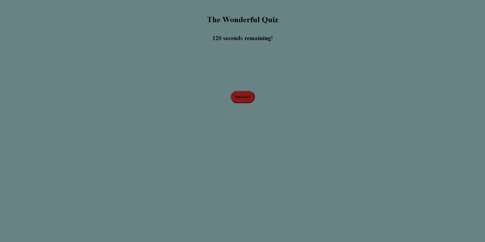

# This was quite the demon

This project was very difficult, but very rewarding from a mental standpoint. Creating a website that had a countdown timer for a quiz was quite the challenge, and unfortunately it defeated me in the end. I was unable to fully complete this project as of yet, and since the due date has passed, I am looking to simply get this out of the way so I can continue the class with less stress. It's a let-down but I will overcome it as time goes on, especially with tutoring sessions.

# Knowledge

Throughout this assignment, I needed to apply javascript and event listeners, as well as an ability to create/access local storage so that I can see my score at the end of the quiz. I failed at the end, but getting there gave me lots of information along the way.

## Here's what we've got.

A link to the github portfolio repository: [https://github.com/cddoigkn/code-quiz](https://github.com/cddoigkn/code-quiz)

A link to the quiz website: [https://cddoigkn.github.io/code-quiz](https://cddoigkn.github.io/code-quiz)

